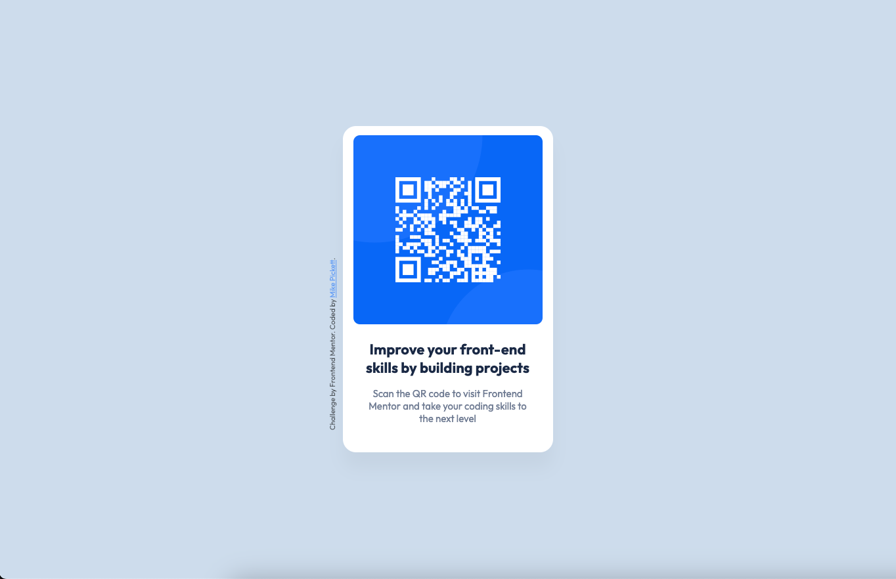

# Frontend Mentor - QR code component solution

This is a solution to the [QR code component challenge on Frontend Mentor](https://www.frontendmentor.io/challenges/qr-code-component-iux_sIO_H). Frontend Mentor challenges help you improve your coding skills by building realistic projects. 

## Table of contents

- [Overview](#overview)
  - [Screenshot](#screenshot)
  - [Links](#links)
- [My process](#my-process)
  - [Built with](#built-with)
  - [What I learned](#what-i-learned)
  - [Continued development](#continued-development)
  - [Useful resources](#useful-resources)
- [Author](#author)

## Overview

### Screenshot



### Links

- [Frontend Mentor Solution](https://your-solution-url.com](https://www.frontendmentor.io/solutions/qr-component-using-html-css-flexbox-QfskAdajiW)
- [MikePickett.dev Link](https://mikepickett.dev/fem-qrcode-component/)

## My process

### Built with

- Semantic HTML5 markup
- CSS custom properties
- Flexbox

### What I learned

While I already knew Flexbox and most of the HTML / CSS used in this challenge, there were a few elements, like the footer text placed vertically on the left side of the container, that required some trial and error to find the best solution. 

I ended up opting to use a transform on the content and absolute positioning. 

```css
.attribution {
  display: flex;
  font-size: 11px;
  text-align: center;
  position: relative;
  transform: rotate(-90deg);
  left: -175px;
  top: 325px;
  opacity: 0.6;
}
```

### Continued development

Learning more as I go including some new methods for display, position and other CSS rules. I am going to try working on the mobile-first approach on the next challenge, the main reason I didn't do it on this one is the preview images provided didn't have any difference between the desktop and mobile versions. 

I also need to get in some more practice with Git / GitHub, this was probably the most frustrating part of this first challenge, I'm not sure why but Git and Github just don't seem to work for me. I'm going to take some time to start working through the training materials provided for these tools to gain a better understanding and see where I'm going wrong. 

### Useful resources

No links to provide here but CSS Tricks, Stackoverflow as well as Google were used in trying to work out the best method to display the vertical text. I tried to work with ChatGPT on this but kept getting code that didn't work. 

## Author

- Website - [Mike Pickett](http://www.mikepickett.dev)
- Frontend Mentor - [@gmdpickett](https://www.frontendmentor.io/profile/gmdpickett)

## Acknowledgments

No one person, but want to thank the creators of Frontend Mentor, I feel like this might actually help to get me back into Frontend Development and possibly even assist in my current role, possibly even help in advancing further in the company I work for. 
